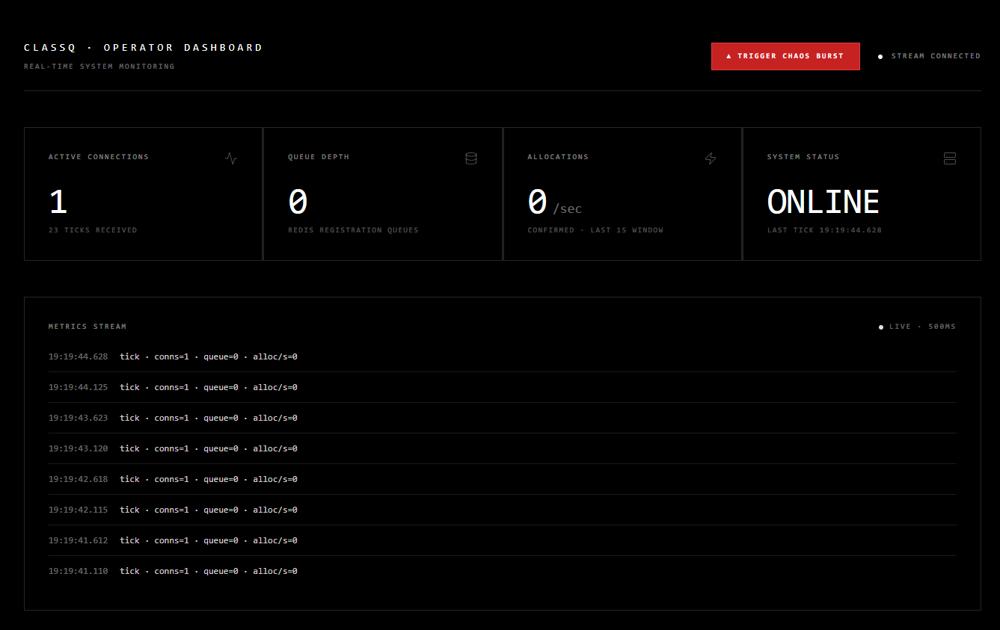
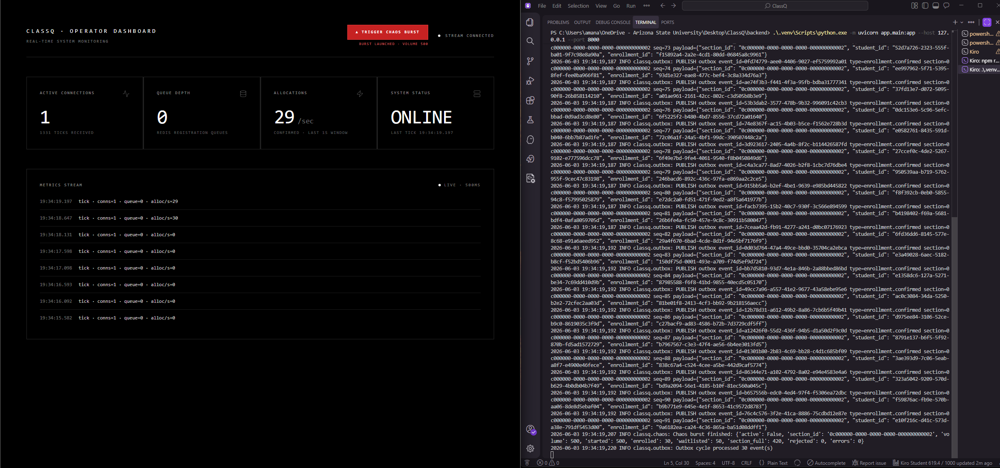
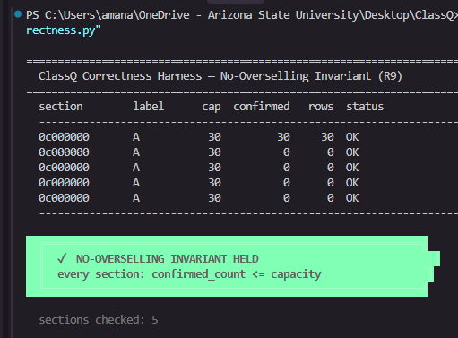
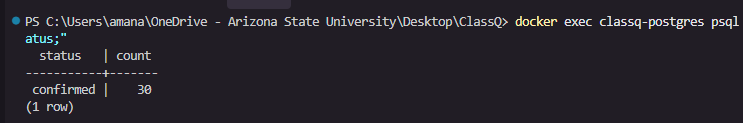
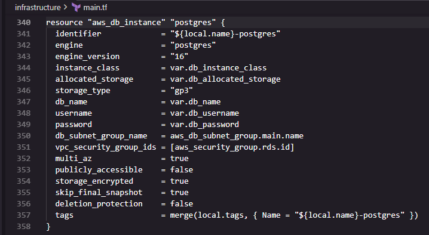
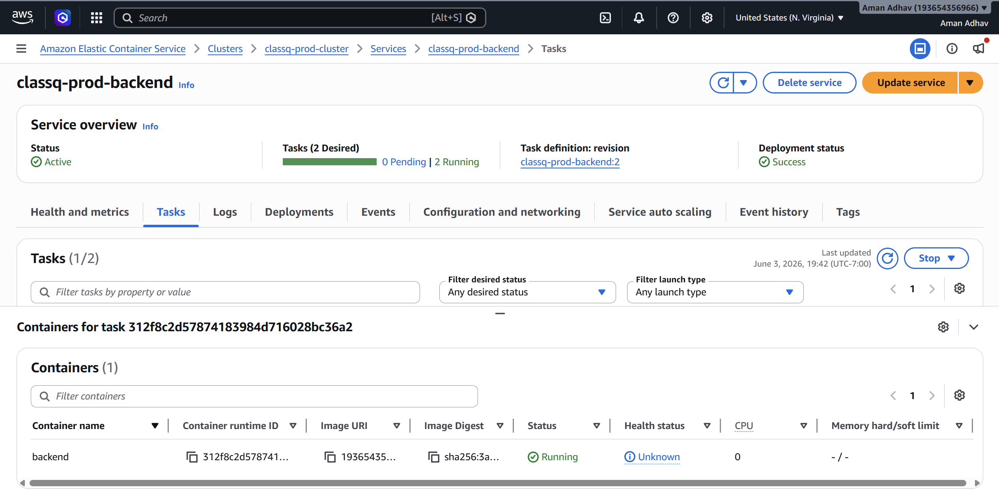

# ClassQ

at ASU, when registration opens at 6am, people go to the library the night before just to make sure they have a stable connection. you hit register, the page hangs, you have no idea if it went through, and by the time you get a response every section of the class you needed is already full.

i wanted to understand why that happens. turns out the hard part isn't building a registration form — it's what happens when 10,000 students all hit the same endpoint at the same second. seats getting double-booked, requests piling up with no feedback, the database becoming the bottleneck for every single operation. i started reading about Redis, atomic operations, and async Python, and decided to just build the thing myself and see how far i could get.

ClassQ is my attempt at a course registration backend that doesn't fall apart under load. it won't replace MyASU, but the core problems — race conditions, seat overselling, fair queueing — are real and solvable, and this is my working solution.

---

## what it does

- atomic seat allocation using Redis Lua scripts so two students can't claim the same seat
- fair waitlist: when a section fills up you get a queue position, not just an error
- prerequisite checking via BFS traversal over a DAG (Linear Algebra before ML, that kind of thing)
- sliding window rate limiting so one client can't spam requests
- a transactional outbox so enrollment events are reliably published without slowing down registrations
- live metrics dashboard (React) that shows queue depth and allocation rate over WebSocket at 500ms
- a "chaos button" that fires 500 concurrent fake registrations to stress test the invariant
- a correctness script that queries the DB afterward and asserts no section was oversold

---

## screenshots

**baseline — system connected, waiting**



**chaos burst — 500 requests hitting a 30-seat section**



**correctness harness — invariant held**



**database query — 30 confirmed, nothing more**



**Terraform IaC — RDS and ECS Fargate blocks**



---

## tech

- **FastAPI** (async) — Python backend
- **Redis / ElastiCache** — seat counters, locks, Lua scripts, waitlists
- **PostgreSQL / RDS** — enrollments, outbox, prerequisites
- **React + Tailwind** — operator dashboard
- **Terraform** — provisions VPC, ECS Fargate, RDS, ElastiCache, ALB on AWS

---

## how it works

### seat allocation

the core race condition: two requests both read `available_seats = 1`, both decide to enroll, both write confirmed. you now have two confirmed enrollments for one seat.

the fix is a Redis Lua script. Redis executes Lua atomically — no two scripts can interleave. the script reads the counter, checks if > 0, decrements it, and records a seat lock in a single operation. if a second request hits while the first lock is held, it gets routed to the waitlist instead.

```lua
local avail = tonumber(redis.call('GET', KEYS[1]) or '0')
if avail <= 0 then
  -- route to waitlist
  redis.call('ZADD', KEYS[4], tonumber(ARGV[2]), ARGV[1])
  return {'WAITLISTED', rank + 1}
end
redis.call('DECR', KEYS[1])
-- record lock, return token
return {'OK', ARGV[3]}
```

### prerequisite checking

prerequisites form a DAG — Machine Learning requires Linear Algebra, Advanced AI Security requires both ML and Binary Exploitation, etc. BFS from the requested course finds every prerequisite reachable in O(V+E). cycle detection runs a separate Kahn topological sort pass (can't use visited-set alone — a diamond shape would false-positive). results are cached in Redis keyed by a version tag so invalidation is instant when a prereq edge changes.

### transactional outbox

enrollment writes and outbox event inserts happen in the same Postgres transaction. if the transaction rolls back, there's no phantom event. a background worker polls pending rows and publishes them, retrying up to 5 times before marking failed. this decouples event delivery from the registration path so a slow downstream consumer can't add latency to a registration request.

### the correctness harness

```python
oversold = await conn.fetch("""
    SELECT section_id, confirmed_count, capacity
    FROM course_sections
    WHERE confirmed_count > capacity
""")
```

if that returns any rows, something is broken. after a 500-bot chaos run it should return nothing.

---

## local setup

**requirements:** Docker, Python 3.12, Node 18+

```bash
# start postgres and redis
cd infrastructure
docker compose up -d

# apply schema
psql -h localhost -U classq -d classq -f ../schema.sql

# seed demo data
cd ..
python scripts/seed.py

# backend
cd backend
python -m venv .venv && source .venv/bin/activate  # or .venv\Scripts\activate on Windows
pip install -r requirements.txt
uvicorn app.main:app --reload

# frontend (separate terminal)
cd frontend
npm install && npm run dev
```

open `http://localhost:5173` for the dashboard. backend is at `http://localhost:8000`.

---

## API

| method | path | description |
|--------|------|-------------|
| GET | `/health` | postgres + redis status |
| POST | `/register` | register a student for a section (header: `X-Student-ID`) |
| GET | `/test/prereq/{student_id}/{course_id}` | check prereq satisfaction |
| POST | `/chaos/start` | start a load burst `{"volume": 500, "section_id": "..."}` |
| POST | `/chaos/stop` | stop the burst |
| GET | `/chaos/status` | burst summary |
| WS | `/ws/metrics` | live metrics stream (500ms) |

---

## AWS deployment

the `infrastructure/main.tf` provisions everything: VPC with public/private subnets, RDS PostgreSQL (Multi-AZ), ElastiCache Redis, ECS Fargate behind an ALB, ECR for the container image.



```bash
cd infrastructure
terraform init
terraform plan -out classq.plan
# review, then:
terraform apply classq.plan
```

build and push:

```bash
docker build -t classq-backend .
aws ecr get-login-password --region us-east-1 | docker login --username AWS --password-stdin <ECR_URL>
docker tag classq-backend:latest <ECR_URL>:latest
docker push <ECR_URL>:latest
aws ecs update-service --cluster classq-prod-cluster --service classq-prod-backend --force-new-deployment --region us-east-1
```

tear down:
```bash
terraform destroy
```

---

## correctness test

```bash
python scripts/correctness.py
```

runs after a chaos burst to verify `confirmed_count <= capacity` for every section. prints a green banner if the invariant held, red if anything was oversold.

---

## project layout

```
ClassQ/
├── backend/
│   └── app/
│       ├── core/         # config
│       ├── db/           # postgres pool, redis client, lua scripts
│       ├── services/     # registration, prerequisites, seat allocator, chaos, metrics
│       └── workers/      # outbox processor
├── frontend/
│   └── src/              # React dashboard
├── infrastructure/
│   ├── docker-compose.yml
│   └── main.tf
├── scripts/
│   ├── seed.py
│   └── correctness.py
├── schema.sql
└── Dockerfile
```
